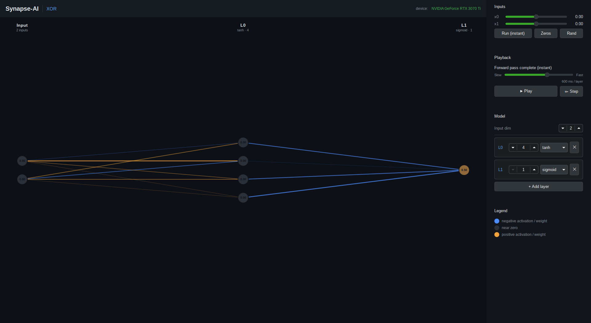
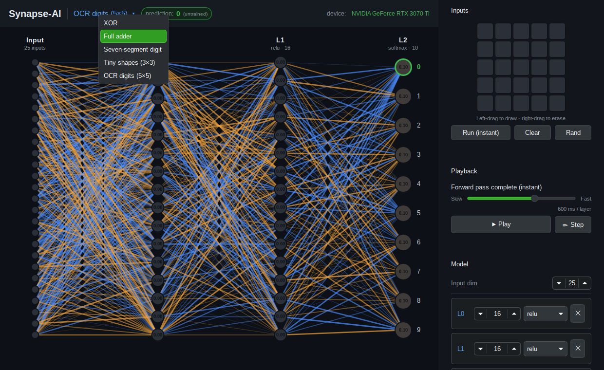

# Synapse-AI

A from-scratch neural-network engine **and** a live visual dashboard for watching it
think. Built to *learn how AI actually works* — every neuron, weight, activation, and
(soon) gradient is visible and adjustable.

The engine is written in **SYCL** (via [AdaptiveCpp](https://adaptivecpp.github.io/)) so
it runs on any hardware — your GPU if you have one, the CPU otherwise. The dashboard is
**Qt 6 / QML**. The two are deliberately kept apart by a small, generic data contract, so
you can change the model however you like and the visualization adapts on its own.



---

## What makes it tick: the decoupled design

The whole project hangs on one idea: **the visualization never knows about any specific
model.** The engine describes itself and streams what it computes through a handful of
plain C++ structs; the dashboard renders whatever it is handed.

```
  ┌─────────────────────────┐     Topology + StepSnapshot      ┌────────────────────────┐
  │  synapse_engine (SYCL)   │  ── (plain C++ structs) ──▶      │  synapse_dashboard      │
  │  tensors, layers, net,    │                                  │  (Qt 6 / QML)          │
  │  forward pass, JSON model │  ◀── load / edit / step ──       │  auto-laid-out graph,   │
  └─────────────────────────┘                                  │  controls, model editor │
        no Qt in here                                          └────────────────────────┘
                                                                   no SYCL in here
```

- **`Topology`** — the network's shape (layers, sizes, activations). The dashboard uses it
  to lay out the columns of neurons. Change it and the graph re-lays-out itself.
- **`StepSnapshot`** — a moment of computation: the current activations, weights, biases,
  and which layer just fired. The dashboard colors nodes and edges from this.

Because that's *all* the dashboard sees, a 2-4-1 XOR net and a 784-128-10 digit classifier
render with **zero** changes to the visualization code. The contract lives in
[`engine/include/synapse/telemetry.hpp`](engine/include/synapse/telemetry.hpp).

### Two ways to change the model — all C++ or raw data, no scripting language

1. **Data (no recompile).** The network's structure and hyperparameters live in a small
   **JSON** file the dashboard edits through nice controls. The engine rebuilds the
   in-memory network instantly. This covers layer count, sizes, and activation choices.
2. **Logic (recompile).** New *math* — a novel activation, a new layer type, a custom
   kernel — is real C++ you edit and recompile. *(Planned; see the roadmap.)*

### Why the engine and dashboard are separate libraries

SYCL (AdaptiveCpp) is compiled by its own Clang toolchain; Qt is compiled by the ordinary
one. Keeping the engine in its own library with **pure-C++ public headers** (no `sycl.hpp`
leaks — the device details hide behind a PIMPL) lets the two toolchains coexist cleanly and
keeps the boundary honest.

---

## Directory layout

```
synapse-ai/
  CMakeLists.txt          top-level build
  CMakePresets.json       the "default" preset: Clang + Ninja + AdaptiveCpp + Qt
  engine/
    include/synapse/      PUBLIC headers — pure C++ (telemetry, network, model_spec)
    src/                  SYCL kernels + logic (tensor, layers, forward pass, JSON)
  dashboard/
    src/                  main.cpp + EngineBridge (C++ ↔ QML)
    qml/                  Main.qml, NetworkView.qml
  models/                 JSON model specs the dashboard reads/writes (xor.json)
  examples/               the original SYCL sandbox files, still buildable
  tests/                  headless engine tests (run via ctest)
```

---

## Prerequisites

These are already installed on the dev machine; listed here for portability.

| Tool          | Why                                  |
|---------------|--------------------------------------|
| AdaptiveCpp   | the SYCL implementation (`acpp`)     |
| Qt 6.5+       | Quick, Qml, QuickControls2, Charts   |
| CMake 3.25+   | build system                         |
| Ninja         | fast generator                       |
| Clang         | C++17 compiler                       |

---

## Build & run

From the repo root:

```bash
cmake --preset default          # configure (Clang + Ninja + AdaptiveCpp + Qt)
cmake --build --preset default  # build everything
```

Then:

```bash
./build/dashboard/synapse_dashboard    # the visual dashboard
ctest --test-dir build                 # run the headless engine tests
./build/examples/matrix_gpu            # the original SYCL sandbox
```

In **VS Code**, the CMake Tools extension picks up `CMakePresets.json` automatically —
choose the "default" preset and hit Build/Run. `clangd` reads the generated
`build/compile_commands.json`.

> **Note:** On startup you may see AdaptiveCpp `[ze_backend]` / `zeInit failed` warnings.
> These are **harmless** — AdaptiveCpp is just probing for an Intel GPU and finding none; it
> then uses whatever device you *do* have (e.g. an NVIDIA GPU via CUDA).

---

## Using the dashboard

When it opens you'll see the network as columns of neurons, with the model name and your
compute device in the header.

**Blueprints** — *pick a model with meaning already assigned*



Click the model name in the header (e.g. **"XOR ▾"**) to open the **Blueprints** menu — a
ladder of ready-made architectures where the inputs and outputs *mean* something:

| Blueprint            | Inputs                     | Outputs                 |
|----------------------|----------------------------|-------------------------|
| XOR                  | 2 labeled bits (A, B)      | A XOR B                 |
| Full adder           | 3 bits (A, B, carry-in)    | Sum, carry-out          |
| Seven-segment digit  | 7 segment toggles (a–g)    | digit 0–9               |
| Tiny shapes (3×3)    | a **paintable 3×3 grid**   | horizontal / vertical / diagonal |
| OCR digits (5×5)     | a **paintable 5×5 grid**   | digit 0–9               |

Picking one sets the input/output dimensions, the layers, *and* the semantics. Grid
blueprints give you a **pixel canvas to draw on**; labeled ones give you named sliders.
For classifiers, output neurons show their labels and the **predicted class** (argmax) is
ringed in green. A blueprint is just a JSON file (see below), so adding your own is a
drop-in — and you can still freely edit any blueprint in the Model panel afterward.

> Predictions are meaningful only **after training** (Phase 4). On an untrained net the
> "prediction" is the argmax of random weights — hence the *(untrained)* tag next to it.

You can also launch straight into one:
`SYNAPSE_BLUEPRINT=ocr_5x5 ./build/dashboard/synapse_dashboard`.

**Reading the picture**
- **Nodes** are neurons. Their color shows the current activation value: **amber** =
  positive, **slate/grey** = near zero, **blue** = negative. The number inside is the value.
- **Edges** are weights. Same color meaning (amber positive, blue negative); thicker/brighter
  = larger magnitude.
- **Columns** are laid out straight from the model's dimensions — the leftmost is your input.

**Inputs** (right panel)
- Drag the `x0, x1, …` sliders to set an input vector.
- **Run (instant)** does a full forward pass immediately. **Zeros** / **Rand** set the inputs.

**Playback** — *watch it happen one step at a time*
- **▶ Play** resets to the input, then propagates through the network **one layer per tick**.
  The active column lights up (white ring); columns not yet computed are dimmed.
- **⏸ Pause** freezes mid-pass.
- **⧐ Step** advances exactly one layer per click — press it repeatedly to walk through the
  computation by hand.
- The **Slow ↔ Fast** slider sets how long each layer lingers (16 ms – 2 s), so you can make
  the signal crawl across the network and actually see each stage.
- The status line tells you what just happened ("Computing L0 …", "output ready ✓").

**Training** — *watch it learn*
- Every blueprint ships with a dataset, so hit **▶ Train** and SGD runs continuously: the
  **loss curve** falls toward zero and, for classifiers, the green prediction ring migrates
  to the correct answer. **⏸ Pause** stops it, **+1 epoch** steps by hand, **Reset**
  re-randomizes the weights to start over.
- The **learn rate** slider sets how big each gradient step is — too small crawls, too large
  diverges. Try it and watch the curve.
- Under the hood: **backpropagation** computes the gradient of the loss with respect to every
  weight (the chain rule, applied layer by layer), then each weight moves a little downhill.
  That math is verified against finite differences in the test suite (`ctest`).
- `SYNAPSE_AUTOTRAIN=1 ./build/dashboard/synapse_dashboard` starts training on launch.

**Data** — *see what it learns from, and teach it yourself*
- The **Data** panel browses the training examples (◀ / ▶). **Show this example** loads it into
  the input, so you can see each digit/pattern the network is being taught.
- **Watch it learn (slow)** animates one gradient-descent step on the current example: the
  forward pass lights up left-to-right, the loss is measured, then the **gradient flows
  backward** (magenta) one layer at a time, and finally the weights update. Paced by the
  Playback speed slider; **⧐ Step** walks it by hand.
- **Manual training** (classifier blueprints): draw/set an input, pick the right **answer**, and
  **+ Add current input** appends it as a new training example. **Save** persists it into the
  blueprint's JSON. Draw a few 7s, add them, and train.

**Model editor** (Tier-1 editing — no recompile)
- Change **Input dim**, a layer's **units**, or its **activation**, or **✕**/**＋ Add layer**.
  Every edit rebuilds the network and the graph re-lays-out itself. (Weights re-initialize on
  a structural change, which also clears the loss curve.)

---

## The JSON model spec

A model is just data. Blueprints live in `models/blueprints/*.json` and are discovered
automatically. `models/blueprints/xor.json`:

```json
{
  "name": "XOR",
  "description": "The classic. Two binary inputs, one output = A XOR B.",
  "input_dim": 2,
  "layers": [
    { "type": "dense", "units": 4, "activation": "tanh" },
    { "type": "dense", "units": 1, "activation": "sigmoid" }
  ],
  "io": {
    "input":  { "layout": "labels", "labels": ["A", "B"], "range": [0, 1] },
    "output": { "layout": "labels", "labels": ["A XOR B"], "kind": "value" }
  }
}
```

- **Architecture** (`input_dim`, `layers`) is read by the *engine*. Each layer's input size
  is inferred from the previous layer. Activations: `linear`, `sigmoid`, `relu`, `tanh`,
  `softmax`.
- **`io`** is read only by the *dashboard* (the engine ignores it) and assigns meaning:
  - `input.layout`: `"labels"` (named sliders, with a `labels` array) or `"grid"` (a
    paintable canvas, with `rows`/`cols`).
  - `output.labels`: a name per output neuron. `output.kind`: `"class"` highlights the
    argmax as a prediction; `"value"` just shows the numbers.

Drop a new file in `models/blueprints/` and it appears in the menu — no code, no rebuild.

---

## How the AI works (the learning arc)

The code is built up in the same order the concepts build on each other:

1. **Tensors** — blocks of numbers on the GPU (`engine/src/tensor.hpp`).
2. **A dense layer** — `output = activation(W · input + b)` (`engine/src/network.cpp`).
3. **Activations** — the non-linearities that let a network learn curves, not just lines.
4. **A forward pass** — stacking layers to turn an input into a prediction. *(you are here)*
5. **Loss** — measuring how wrong the prediction is. *(next)*
6. **Backpropagation** — the chain rule computing how each weight affected the error.
7. **An optimizer** — nudging weights down the gradient. Repeat = learning.

---

## Roadmap

- [x] **Phase 0** — build system + toolchain (SYCL engine links into the Qt app)
- [x] **Phase 1** — engine forward path + the telemetry contract
- [x] **Phase 2** — live network + activations dashboard, JSON model editor
- [x] **Playback** — speed control + step-through of the forward pass
- [x] **Phase 3** — Blueprints: template architectures with meaning assigned to the inputs
      and outputs (paintable pixel grids, labeled I/O, predicted-class highlight)
- [x] **Phase 4** — training: loss (MSE + cross-entropy), **backprop from scratch**
      (finite-difference gradient-checked), SGD, a **live loss curve**, learning-rate
      control, a **dataset for every blueprint**, **dataset browsing + draw-your-own
      examples**, and a **gradient-flow animation** — watch one SGD step in slow motion
      (forward → loss → backprop layer-by-layer → weight update).
- [ ] **Phase 5** — beginner vs advanced views (histograms, per-layer stats, annotations)
- [ ] **Phase 6** — GUI-driven C++ recompile (Tier-2), engine as a separate process over IPC

---

## Troubleshooting

- **`[ze_backend] zeInit failed` on startup** — harmless (see the build note above).
- **`Main.qml` reset to a "Qt Design" stub** — a Qt visual designer overwrote it. It replaces
  the whole file, so hand-edit the QML directly and don't open `Main.qml` in the designer.
- **First run is slow / "JIT-compiled" warning** — AdaptiveCpp's `generic` target compiles
  kernels on first use; subsequent runs are cached and faster.
